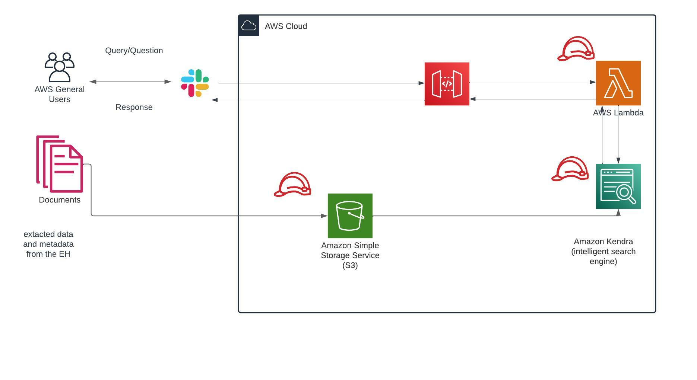

# AWS-native-Intelligent-text-search
## The solution consists of the following steps:
* Data prepration (Extraction and Transformation)
* Load data in Amazon S3 (Simple Storage Service)
* Create Amazon Kendra Index
* Connect Amazon S3 as data source (add documents into the index)
* Query the index to get the result
  * Amazon API Gateway
  * AWS Lambda
  * Integration with Slack to apply intelligent search through organization documents
 
 

